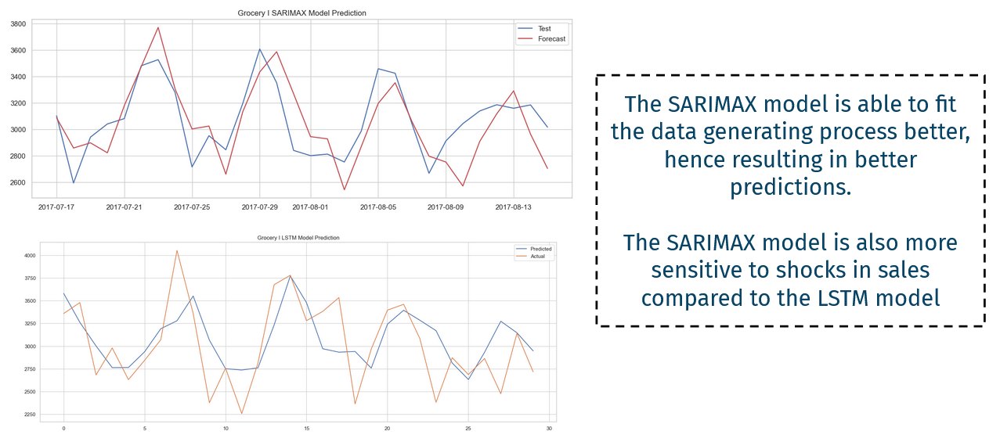

# IndonesiaAI-Portfolio-Project-1
📁 Created by: Mohammad Arief Rajendra, in March 2024

## Project 1: Sales Forecasting

The Sales Forecasting Project is part of Indonesia AI's Bootcamp Portfolio Project, which tasks students with developing machine learning algorithms to forecast sales in Ecuador, South America. The data includes 33 types of products, with about 3 million observations. 

To predict future sales of the products, we utilize several time-series machine learning techniques, including simple models like the Autoregressive Integrated Moving Average (ARIMA) model, to more complicated deep learning models, such as the Long Short-Term Memory (LSTM) Recurrent Neural Network (RNN) models.

## Getting Started

You can easily implement the code in this repository by:

1. Cloning this project
2. Set up Python and Jupyter Notebook locally, either directly from Python or using Anaconda, or you can use Google Colab if you wish to have faster processing without a local GPU
3. Make sure that you have installed the required packages that are included at the start of the Jupyter Notebook .ipynb file
4. Run the code as is, or add your modifications

## The Result

In both the Grocery I and Beverages category, the SARIMAX model tend to perform better than the LSTM Model

